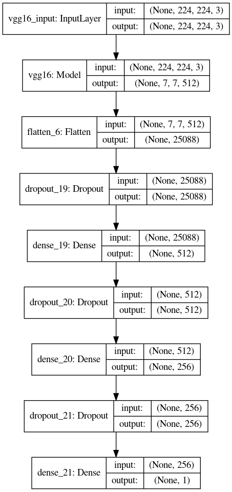
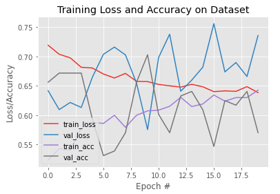
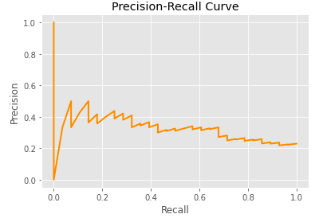
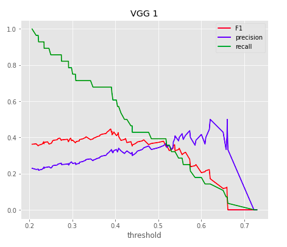

# FDA  Submission

**Your Name:** Felix Glushchenkov

**Name of your Device:** Pneumonia Detection Assistant from X-Ray Images

## Algorithm Description 

### 1. General Information

**Intended Use Statement:** To assist the radiologist in detecting pneumonia in X-Ray images.

**Indications for Use:**
Screening X-Rays for pneumonia.
Ages: 1-95
Ages 25th to 75th quantiles: 35-60.
Gender: Men and Women
X-Ray properties: 
- position (AP/PA)
- modality (DX)
- body part scanned:  chest

**Device Limitations:**

**Clinical Impact of Performance:**
As users, we are interested in the validity of what the model outputs - that is, if it says it's positive for pneumonia, how likely is that?
Similarly, if it says there's no pneumonia, with what probability is that true?

Note: tn=true neg, tp=true pos, fn=false neg, fp=false pos.

The first metric is called precision, and it is equal to "number of true positive / number of cases we think are positive = tp / (tp + fp)".
For model 1 and threshold=0.39: precision = 19/(19+38)=0.33.
For model 2 and threshold=0.37: precision = 18/(18+43)=0.29

The second metric is known as the negative predictive value and is calculated as "number of true negative / number of cases we think are negative = tn / (tn + fn)"
For model 1: npv = 62/(62+9)=0.87.
For model 2: npv = 57/(57+10)=0.85

Another key metric is recall: among the positive cases in the data (tp & fn), how  many are identified as positive?
Model 1 recall = tp/(tp+fn) = 19/(19+9)=0.68
Model 2 recall =0.64

So, model 1 has slightly better metrics.

We are able to identify 68% of the positive cases in the dataset, but that comes with a lot of false positives due to low precision.
However, we can identify 87% of the negative cases correctly with few false negatives. Thus, the value of the model lies in its detection of non-pneumonia images.

### 2. Algorithm Design and Function
Both models are VGG 16 pretrained networks but #1 has its last convolutional layer unfrozen.
#2 is all frozen. Both models have 2 fully connected layers of 512 and 256 neurons and 1 output neuron stacked on top of the CNN.
Since the first model had better performance, it will be described below.

<< Insert Algorithm Flowchart >>


**DICOM Checking Steps:**
1. Check modality is an X-Ray scan (DX)
2. Check it's a scan of the chest
3. Check view angle is PA or AP.

**Preprocessing Steps:**
1. scale pixels to the interval [0,1]
2. resize the image to (batch, height, width, channels)=(1,224,224,3)
3. pass the image through the keras preprocess function for VGG16 networks. It converts RGB to BGR, each channel is zero centered with respect to ImageNet, with no scaling.

**CNN Architecture:**


### 3. Algorithm Training

**Parameters:**
* Types of augmentation used during training: 
- rescale pixels to [0,1]
- horizontal flip
- height shift range: 0.1
- width shift range: 0.1
- rotation range: 10
- shear range: 0.1
- zoom range: 0.1
- vgg16.preprocess_input()
* Batch size: 32
* Optimizer learning rate: 0.00001
* Layers of pre-existing architecture that were frozen: all layers of VGG16, except the very last convolutional layer
* Layers of pre-existing architecture that were fine-tuned: the very last convoluational layer
* Layers added to pre-existing architecture: flatten, dropout 0.4, dense 512, dropout 0.4, dense 256, dropout 0.4, dense 1.

Algorithm training performance visualization


P-R curve


**Final Threshold and Explanation:**

The final threshold was 0.39. This struck a good balance between F1, precision, and recall as seen below:


Any lower, and F1 and precision decrease but recall increases. In fact false positives increase substantially as the threshold is dropped which may waste radiologist's time.
A general feature of the model is its ability to throw out negative cases due to its high negative predictive value, rather than correctly detect positive cases.
At a threshold of 0.39, the NPV is at its maximum.


### 4. Databases

**Description of Training Dataset:** 
The training set contains a 50-50 positive-negative split of pneumonia cases with 2290 images.

**Description of Validation Dataset:** 
The validation set contains a 20-80 positive-negative split of pneumonia cases with 1430 images.

### 5. Ground Truth
From the [Kaggle data source](https://www.kaggle.com/nih-chest-xrays/data):
```
This NIH Chest X-ray Dataset is comprised of 112,120 X-ray images with disease labels from 30,805 unique patients.
To create these labels, the authors used Natural Language Processing to text-mine disease classifications from the 
associated radiological reports. The labels are expected to be >90% accurate and suitable for weakly-supervised learning.
```

Disease labels include: atelectasis, consolidation, infiltration, pneumothorax, edema, emphysema, fibrosis, effusion, pneumonia, pleural thickening, cardiomegaly, nodule, mass, and hernia.

### 6. FDA Validation Plan

**Patient Population Description for FDA Validation Dataset:**
Men and women, aged 2 to 95, whose chest was scanned with an x-ray machine in the PA/AP positions. Those patients with consolidation, nodule, or infiltration might be viewed as pneumonia positive by the algorithm since the pixel intensity distributions are similar.

**Ground Truth Acquisition Methodology:**
An optimal ground truth can be obtained via a sputum test (phlegm from a deep cough), pleural fuild culture test (fluid sample from the space between the tissues lining the lungs and chest cavity), or a bronchoscopy (tube with camera inserted into windpipe, with optional biopsy). 
However, these tests take a long time to conduct and are costly.

**Algorithm Performance Standard:**
This [paper](https://arxiv.org/pdf/1711.05225.pdf) reports an F1 score of 0.435 (confidence interval: 0.387, 0.481) for their model and an average of 0.387 (CI: 0.330, 0.442) for 4 radiologists. 
They found their model is statiscally significantly better than the radiologist performance by calculating the difference between the average F1 score of their model and the average F1 score of the radiologists. The 95% CI on the difference did not include 0, and so they concluded their model was a statistically significant improvement over the radiologist's performance.

My model's maximum F1 score was 0.447, however the 95% confidence intervals were not calculated.
